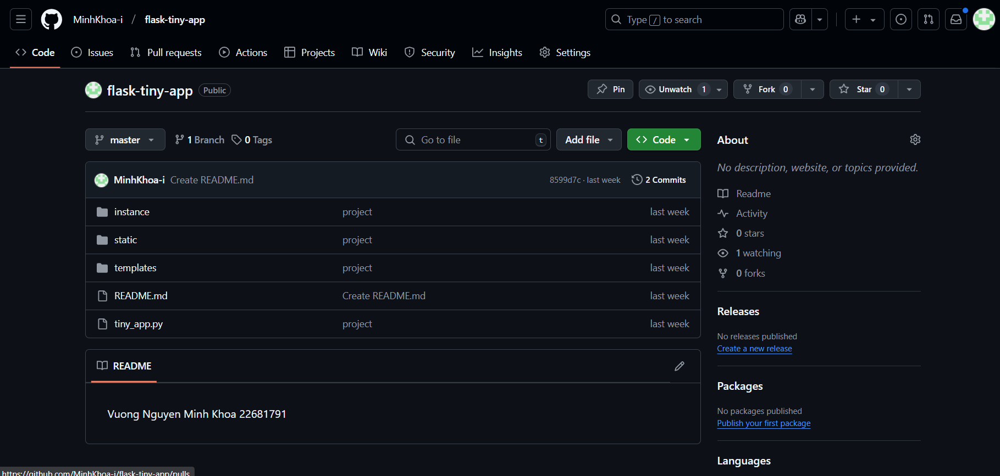

 Mô tả:

Push mã nguồn project ban đầu lên GitHub.
Giao diện ban đầu gồm:
index.css: Trang chính với giao diện đơn giản.
login.css: Form đăng nhập cơ bản.
register.css: Form đăng ký người dùng.
dashboard.css: Trang dashboard cho user.
admin.css: Trang quản trị ban đầu.

