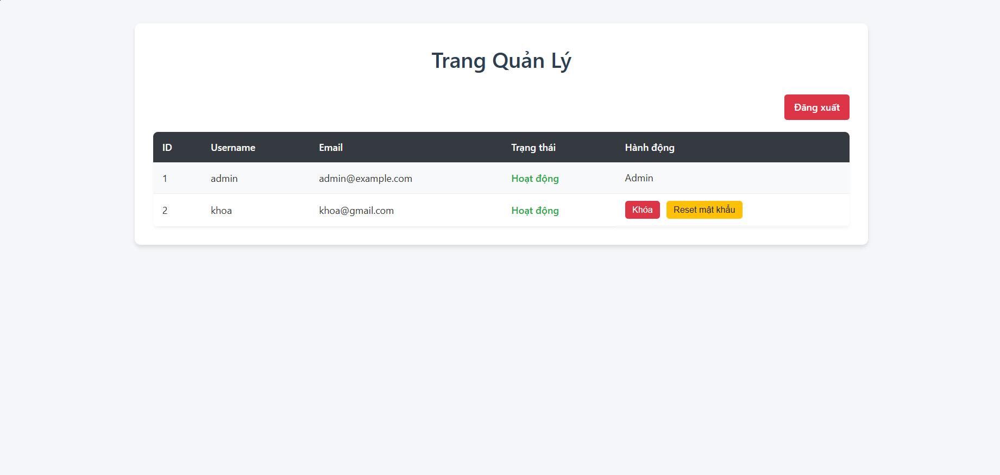
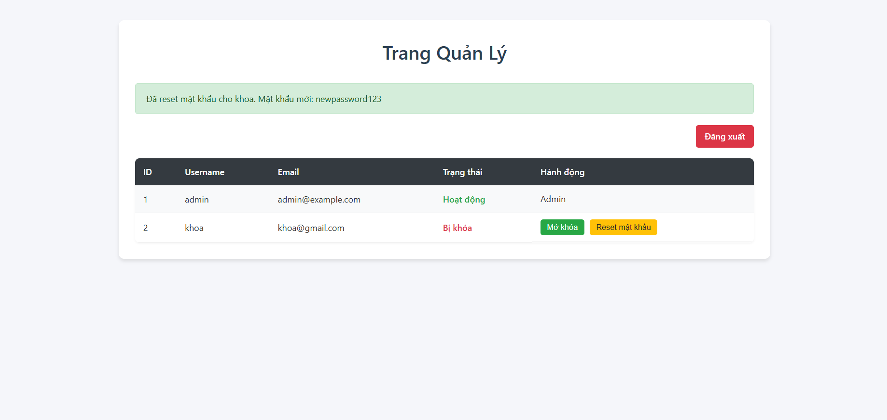
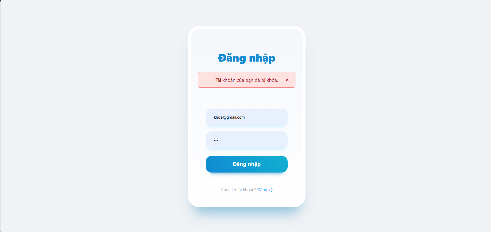

Mô tả:

Viết thêm trang admin (admin.css) để quản lý user.

Chức năng khóa (block) user và reset mật khẩu.

Khi user bị block, họ sẽ không thể đăng nhập, hiển thị thông báo: "Tài khoản của bạn đã bị khóa.".

